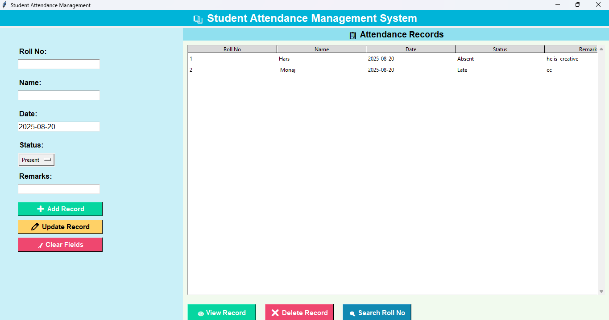

# 📚 Student Attendance Management System (Tkinter + SQLite)

A simple **Student Attendance Management System** built using **Python, Tkinter, and SQLite3**.  
This project allows you to **add, view, update, search, and delete attendance records** with a clean graphical interface.

---

## 🚀 Features
- ➕ Add new attendance records (Roll No, Name, Date, Status, Remarks)  
- ✏ Update existing records  
- ❌ Delete records easily  
- 🔍 Search by Roll No  
- 📅 Auto-filled current date  
- ✅ Pre-set Status options: **Present, Absent, Late**  
- 📋 Striped table view with scroll support  
- 🗄️ SQLite database included for **experimental learning**  

---

## 📂 Database
The project uses **SQLite (`Attendance.db`)**.  
A ready-to-use database is provided so you can start experimenting without extra setup.

---

## 🖼️ GUI Preview
The application is built with **Tkinter** and provides a **two-panel interface**:
- **Left panel** → Input form + action buttons  
- **Right panel** → Records table + quick actions  

> 

---

## ▶️ Tutorial Video
I have created a step-by-step tutorial for this project.  
📺 Watch it here on **YouTube**:  
👉 [Click here for the full tutorial](https://youtube.com/@ag_youtube?si=FAn7IlqlXNEWTPRJ)

---

## 🛠️ Installation & Usage
1. Clone this repository:
   ```bash
   git clone https://github.com/your-username/student-attendance-system.git
   cd student-attendance-system
   ```

2. Run the script:

   ```bash
   python attendance.py
   ```

3. Start managing attendance with the GUI.

---

## 📌 Requirements

* Python 3.x
* Tkinter (comes pre-installed with Python)
* SQLite3 (comes built-in with Python)

---

## 📖 Notes

* The provided `Attendance.db` already has a sample structure.
* You can clear it anytime to start fresh.
* Roll No is the **primary key**, so it must be unique.

---

## ⭐ Contribution

Feel free to **fork this repo**, play around, and suggest improvements.

If you find this helpful, don’t forget to **like, share, and subscribe** on my YouTube channel 🚀

---

- ✍️ **Author**: **Anshu Gondi**

- 📺 **YouTube**: [AG YouTube](https://youtube.com/@ag_youtube?si=FAn7IlqlXNEWTPRJ)